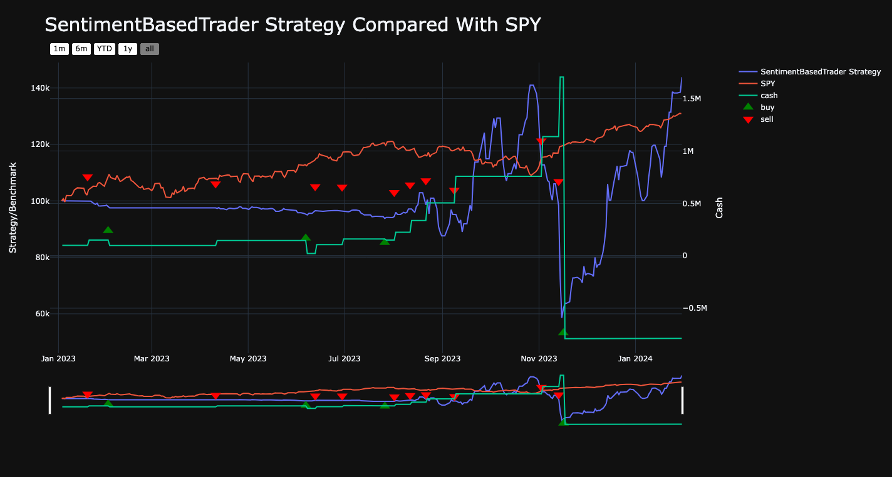

# Sentiment-Based Trading Strategy

This project contains the implementation of a sentiment-based trading strategy that leverages news headlines to make trading decisions on the Alpaca platform. The strategy, named `SentimentBasedTrader`, uses the FinBERT model for sentiment analysis to evaluate the sentiment of news related to a specified stock symbol and makes buy or sell decisions based on the analysis.

## Strategy Overview

The `SentimentBasedTrader` strategy is built on top of the Lumibot framework, a versatile toolkit for algorithmic trading. The strategy uses sentiment analysis to evaluate market sentiment from news headlines and execute trades accordingly. When the sentiment is overwhelmingly positive, it places a buy order; conversely, if the sentiment is negative, it places a sell order. The strategy includes risk management through bracket orders that set predefined prices for taking profits and stopping losses.


## Requirements

- Python 3.8+
- `lumibot` package
- `alpaca-trade-api` package
- `transformers` package
- `torch` package
- An Alpaca brokerage account with API access

## Installation

Before running the strategy, ensure you have all the required packages installed. You can install the packages using pip:

```bash
pip install lumibot alpaca-trade-api transformers torch
```
ALPACA_CREDS = {
    "API_KEY": "your_alpaca_api_key",
    "API_SECRET": "your_alpaca_api_secret",
    "PAPER": True
}

## Configuration

To run the strategy, you need to set up your Alpaca API credentials. Replace the placeholder values in the ALPACA_CREDS dictionary with your actual Alpaca API key and secret.

```python
ALPACA_CREDS = {
    "API_KEY": "your_alpaca_api_key",
    "API_SECRET": "your_alpaca_api_secret",
    "PAPER": True
}
```
### Running the Strategy

To run the backtest of the strategy, you can execute the script using Python:

```bash
python sentiment_based_trader.py
If you wish to run the strategy in paper trading or live trading modes, uncomment the lines at the bottom of the script and make sure your Alpaca account is configured accordingly.
```

## Backtesting

The backtest uses historical data from Yahoo Finance. The time range for the backtest is defined by the start_date and end_date variables:

```python
start_date = datetime(2023, 1, 1)
end_date = datetime(2024, 1, 31)
```
